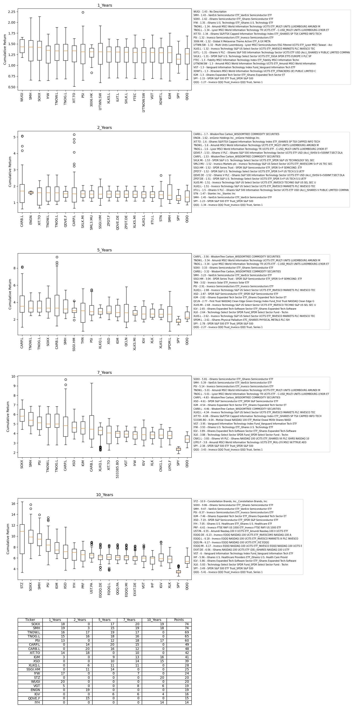

# ETF_compare
### Performance comparison for ETFs listed on Yahoo Finance
  
This project is a wrapper around the well known *yfinance* module, with a focus on ETFs.
The project collects monthly ETF price data from the Yahoo Finance API and parses the price data to provide information 
about the best performing ETFs in terms of median return for a number of holding periods.
 
The result is a visual report designed to help the user with making her ETF purchase.
 
The report ranks the best performing ETFs from left to right for each holing period
The table at the bottom of the report provides a comprehensive summary of the boxplots. 
The higher the median return an ETF achieves within a holding period, the more points it is allocated. 
For instance, if there are 15 ETFs/boxplots within a holding period, the ETF with the highest median return would receive 15 points. 
The best-performing ETFs overall are those with the highest total points across all holding periods.
  

  

The project comes with:
- ETF_Tickers.csv - a list of ETF tickers
- ETF_Description.pkl - a pre-made description file providing names for ETFs 
- ETF_Data.pkl - a pre-made file holding all relevant price data
  
### 1st time run (User will create the ETF_Description.pkl and ETF_Data.pkl) :

`from etf_compare import EtfCleaner, EtfAnalyzer`
 
`cleaner = EtfCleaner()`
 
`cleaner.etf_list_path = "your_path/ETF_Tickers.csv" ` # set the path to the list of tickers
 
`cleaner.make_description_file(path = "your_path/ETF_Description.pkl")` # create ETF description file for given tickers, this can take time
 
`cleaner.etf_description_path = "your_path/ETF_Description.pkl` # set the path to the ETF description file
 
`cleaner.make_etf_data("your_path/ETF_Data.pkl")` # create ETF data file which holds the price data for all ETF tickers, this can take time
 
`cleaner.etf_data_path = "your_path/ETF_Data.pkl"`# set the path to the ETF price data file
  

After the ETF_Description.pkl and ETF_Data.pkl files are created:
  
`etf_data = cleaner.etf_data` # make the ETF price data object
 
`etf_description = cleaner.etf_description` # make the ETF description data object
 
`analyzer = EtfAnalyzer()` # make an EtfAnalyzer object
 
`analyzer.etf_dict_maker(etf_data, etf_description)` # read in the ETF price and ETF description into the EtfAnalyzer object ,this creates analyzer.etf_dict attribute 
 
`EtfAnalyzer.plot_tool(
    analyzer.etf_dict,
    boxplot_no=20,
    compare_list=['SOXX','SPY'],
    fig_path= "your_path/boxplots.png"
)`  # run the plotting tool to obtain a comprehensive visual report about the ETF performance.
You can set the number of boxplots /ETFs per report, you can also add an arbitrary ETF into the comparison list.
   

### 2nd time run (User has already created ETF_Description.pkl and ETF_Data.pkl)
The user can simply load the pre-made pkl files. No need to create them, this will save lot of runtime
 

`from etf_compare import EtfCleaner, EtfAnalyzer`
 
`cleaner = EtfCleaner()`
 
`cleaner.etf_list_path = "your_path/ETF_Tickers.csv" ` 
 
`cleaner.etf_description_path = "your_path/ETF_Description.pkl` 
 
`cleaner.etf_data_path = "your_path/ETF_Data.pkl"`
  
`etf_data = cleaner.etf_data` 
 
`etf_description = cleaner.etf_description`
 
`analyzer = EtfAnalyzer()` 
 
`analyzer.etf_dict_maker(etf_data, etf_description)`
 
`EtfAnalyzer.plot_tool(
    analyzer.etf_dict,
    boxplot_no=20,
    compare_list=['SOXX','SPY'],
    fig_path= "your_path/boxplots.png"
)` 

NOTE:

The *etf_dict_maker* method supports:
- changing the holding period (by default  set to 1,2,5,7,10), 
however this implies making corresponding changes to the *_etf_ranking* and *plot_tool* methods
- changing the time frame around the holding period (by default set to 5 years)
  

The *plot_tool* method supports:
- adding up to 20 boxplots
- adding arbitrary ETFs to compare them with the best performing ETFs (use the compare_list argument)
- by default the leverage ETFs are removed (argument: leveraged_substrings=('2X', '2x', '3X', '3x', 'Leveraged', 'ProShares'),
- remove the ETFs for which the API returns incorrect data (argument: corrupt_keys=['EU', 'RYF','EEP.PA', 'BITCOIN-XBT.ST'])

 