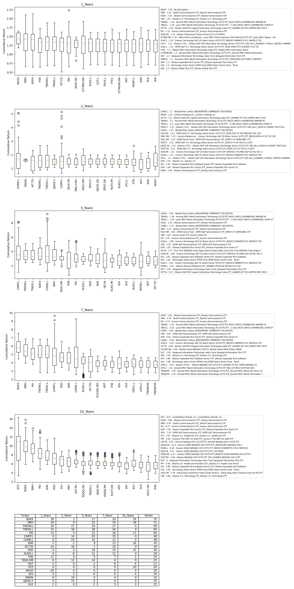

# ETF_compare

## What is ETF_compare ? 
ETF_compare enables performance comparison for ETFs supported by the Yahoo Finance API.
The project is a wrapper around the well known ***yfinance*** module, with a focus on ETFs.
The project collects monthly ETF price data from the Yahoo Finance API and parses the data to provide information 
about the best performing ETFs, in terms of median return, for a range of different holding periods.
## What does ETF_compare deliver? 
The end output of the code is a visual report designed to help the user with making her ETF investment.
By default, the report contains 5 blocks of boxplots -  one block for each of the holding periods (1, 2, 5, 7 and 10 years). 
When running the code, the user defines the number of best-performing ETFs she wishes to compare. 
For instance, if the user wants to compare the 15 best performing ETFs, each holding period block will contain 15 boxplots - one boxplot per ETF.
Within each block, the report ranks the best performing ETFs from left to right based on median return.
<br><br>
The table at the very bottom of the report provides a comprehensive summary of all the boxplots above. 
The higher the median return an ETF achieves within a holding period, the more points it is allocated. 
For instance, if there are 15 ETFs/boxplots within a holding period, the ETF with the highest median return would receive 15 points. 
The best-performing ETFs overall are the ones with the highest total points across all holding periods.
<br><br>


<br><br>


## How to run the ETF_compare ?

The project comes with:
- ETF_Tickers.csv     - a list of ETF tickers
- ETF_Description.pkl - a pre-made description file providing names for ETFs 
- ETF_Data.pkl        - a pre-made file holding all relevant price data
<br><br>

### Running the code for the first time 
In order to obtain the most accurate report, the ETF data should be up-to-date. 
In the first run, or if the last run is older than a month, it is recommended to generate the ETF_Description.pkl and ETF_Data.pkl again.
Run the *main_first_run.py* script:

```python
from etf_compare import EtfCleaner, EtfAnalyzer

your_path= "your_path"
cleaner = EtfCleaner()   # initialize the cleaner object
cleaner.etf_list_path =  your_path + "/ETF_Tickers.csv"  # set the path to the list of tickers
cleaner.make_description_file(path= your_path + "/ETF_Description.pkl")  # create ETF description file for given tickers (this can take time)
cleaner.etf_description_path = your_path + "/ETF_Description.pkl"  # set the path to the ETF description file
cleaner.make_etf_data(your_path + "/ETF_Data.pkl")  # create ETF data file which holds the price data for all ETF tickers (this can take time)
cleaner.etf_data_path = your_path + "/ETF_Data.pkl"  # set the path to the ETF price data file

# After the ETF_Description.pkl and ETF_Data.pkl files are generated, the script creates the report:

# Access the ETF data and description from the cleaner object
etf_data = cleaner.etf_data 
etf_description = cleaner.etf_description

analyzer = EtfAnalyzer()  # Initialize the analyzer object
analyzer.etf_dict_maker(etf_data, etf_description)  
# read in the ETF price and ETF description into the analyzer object, this creates analyzer.etf_dict attribute

# Run the plotting tool to obtain a comprehensive visual report about ETF performance.
EtfAnalyzer.plot_tool(
    analyzer.etf_dict,
    boxplot_no=20, # set the number of boxplots/ETFs per report - up to 20
    compare_list=['SOXX', 'SPY'], # optionally, add individual tickers to the compare list
    fig_path=your_path + "/boxplots.png"
)
```

### Running the code for the second time 
If the user has recently generated the ETF_Description.pkl and ETF_Data.pkl files, the user can 
simply load them. No need to generate them again, this will save lot of runtime.
Run the *main_second_run.py* script:
<br>

```python
from etf_compare import EtfCleaner, EtfAnalyzer

your_path= "your_path"

# Initialize the EtfCleaner object
cleaner = EtfCleaner()  # initialize the cleaner object
cleaner.etf_list_path = your_path + "/ETF_Tickers.csv" # set the path to the list of tickers
cleaner.etf_description_path = your_path + "/ETF_Description.pkl"  # set the path to the ETF description file
cleaner.etf_data_path = your_path + "/ETF_Data.pkl" # set the path to the ETF price data file

# Access the ETF data and description from the cleaner object
etf_data = cleaner.etf_data
etf_description = cleaner.etf_description


analyzer = EtfAnalyzer() #Initialize the analyzer object
analyzer.etf_dict_maker(etf_data, etf_description)
# read in the ETF price and ETF description into the analyzer object, this creates analyzer.etf_dict attribute


# Run the plotting tool to obtain a comprehensive visual report about ETF performance.
EtfAnalyzer.plot_tool(
    analyzer.etf_dict,
    boxplot_no=20, # set the number of boxplots/ETFs per report - up to 20
    compare_list=['SOXX', 'SPY'],  # optionally, add individual tickers to the compare list
    fig_path = your_path + "/boxplots.png"
)
```

## Notes:

The ***etf_test.py*** script runs in the tests folder performs all the relevant unit tests 

The ***etf_dict_maker*** method supports:
- changing the holding period (by default  set to 1, 2, 5, 7, 10), 
however this implies making corresponding changes to the *_etf_ranking* and *plot_tool* methods
- changing the time frame around the holding period (by default set to 5 years)
<br><br>

The ***plot_tool*** method supports:
- adding up to 20 boxplots
- adding arbitrary ETFs to compare them with the best performing ETFs (use the compare_list argument)
- by default the leverage ETFs are removed (argument: leveraged_substrings=('2X', '2x', '3X', '3x', 'Leveraged', 'ProShares'),
- the ETFs for which the API returns incorrect data are removed (argument: corrupt_keys=['EU', 'RYF','EEP.PA', 'BITCOIN-XBT.ST'])

The ***output.log*** file contains the log messages from loading the ETFs via *yfinance*

